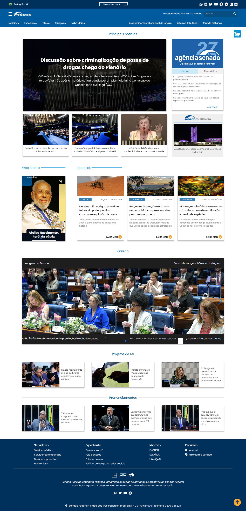
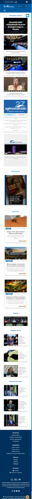

[![MIT License][license-shield]][license-url]
[![Version][version-shield]][version-shield]

 

    
     

  <h3 align="center">Desafio Designer/Frontend - Senado</h3>

  

    Protótipo de Design para a página inicial do Senado Notícias
     
    <a target="_blank" href="https://desafio-senado.vercel.app"><strong>Explore o projeto »</strong></a>
     
     
    <a href="#sobre">Sobre</a> •
    <a href="#tecnologias">Tecnologias</a> • 
    <a href="#utilitarios">Utilitários</a> • 
    <a href="#preview">Preview</a> • 
    <a href="#licenca">Licença</a> •
    <a href="#contato">Contato</a>
  

<!--Sobre o Projeto-->
<h2 id="sobre">💻 Sobre o projeto</h2>

Esse projeto consiste na elaboração de uma nova proposta de design para a página inicial do **[Senado Notícias][senado-noticias]**. O protótipo mantém a identidade visual do site original e apresenta modificações, que visam torná-lo mais intuitivo, fácil de navegar e bonito, além de melhorar a experiência geral do usuário.

<!--Tecnologias-->
<h2 id="tecnologias">🛠 Tecnologias utilizadas</h2>

As seguintes ferramentas foram usadas na construção do projeto:

-   **[HTML][html]**
-   **[CSS][css]**
-   **[SASS][sass]**
-   **[JavaScript][javascript]**

<!--Utilitários-->
<h2 id="utilitarios">💡 Utilitários</h2>

-   Protótipo: 🎨 **[Figma][figma]**
-   Ícones: **[Font Awesome][fontawesome]**
-   Fontes: **[Poppins][poppins]**

<!--Preview do projeto-->
<h2 id="preview">🔎 Preview do projeto</h2>

### 🌐 Web

### 📱 Mobile

<!--Licença-->
<h2 id="licenca">📝 Licença</h2>

Esse projeto está sob a licença [MIT][license-url].

Veja o arquivo `LICENSE` para mais detalhes.

<!--Contato-->
<h2 id="contato">✉️ Contato</h2>

<table>
    <tr>
        <td align="center">
            <a href="https://www.linkedin.com/in/joao-souza07">
                
                 
                <b>João Souza</b>
            </a>
             
            <a href="https://github.com/joaosouza7">🚀</a>
        </td>
    </tr>
</table>
 

(<a href="#readme-top">🔝 Voltar ao topo</a> )

<!-- LINKS E IMAGENS -->

[license-shield]: https://img.shields.io/badge/LICENSE-MIT-green?style=for-the-badge
[license-url]: ./LICENSE
[version-shield]: https://img.shields.io/badge/VERSION-1.0.0-dc3545?style=for-the-badge
[html]: https://developer.mozilla.org/pt-BR/docs/Web/HTML
[css]: https://developer.mozilla.org/pt-BR/docs/Web/CSS
[sass]: https://sass-lang.com/
[javascript]: https://developer.mozilla.org/pt-BR/docs/Web/JavaScript
[figma]: https://www.figma.com/file/Bnsh9qQM9sKNJ91IRUfBHH/Desafio---VagaSenado?type=design&node-id=0%3A1&mode=design&t=DoyDmxBNie62svPx-1
[poppins]: https://fonts.google.com/specimen/Poppins?query=popp
[fontawesome]: https://fontawesome.com/
[senado-noticias]: https://www12.senado.leg.br/noticias
